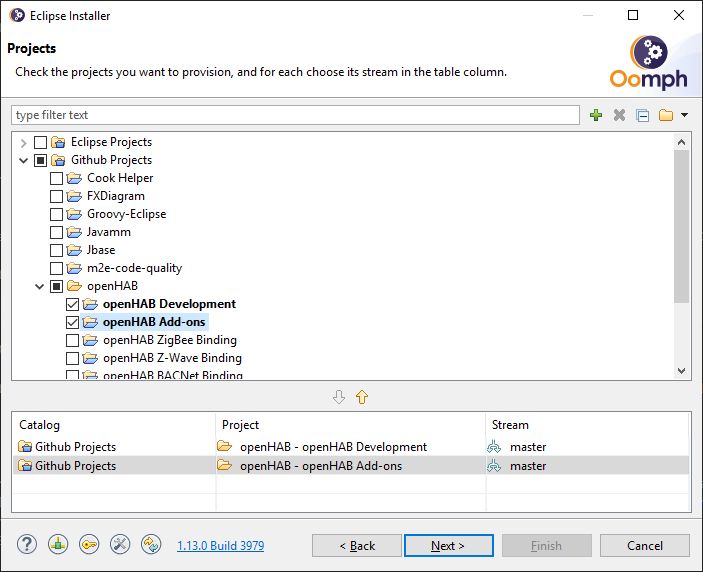

# Eclipse IDE

::: tip TODO
We are currently reworking how to setup a perfect development enviroment.
A new step by step guide will appear here soon.
:::

For now follow these steps:

### Eclipse IDE Setup

This guide focuses on existing Add-on (binding) development.

1. Download the "Eclipse Installer": [can be downloaded from the Eclipse web site](https://wiki.eclipse.org/Eclipse_Installer)
1. Launch the Installer and on the menu on the top right (3 bars) select `ADVANCED MODE...`, then select `Eclipse IDE for Java Developers` then `Next >`.

    Eclipse version to use is "Latest Release (2019-03)" (currently version `2019-06` does not support bndtools)

1. Select `Github Projects > openHAB > openHAB Development`. 
    
    Do *NOT* select other projects.

   

1. Click `Next >`, verify/modify Root and install folder name, click `Next >` and `Finish` to start installation. During install accept licence agreement, "Unsigned Content" for Bndtools, and Eclipse Foundation certificates when requested to complete IDE installation. 

    When the installation is finished the IDE is launched automatically.

1. **It's important**, during the first Eclipse IDE launch, to leave the Eclipse open until all Startup tasks / Download sources / Builds are completed. These tasks will setup the IDE with proper tools, configurations and download openHAB lastest distribution, the compiled `openhab2-addons` (bundles) and related maven dependencies.
(click bottom right button in the IDE for Progress).

    **It may take 20-35mins depending on internet connection and your computer speed.
    So go and grab a good cup of coffee and be patient until is finished**

1. Using Git bash console move to the `git` folder under the chosen IDE install folder (the `openhab-distro` folder is already there).

1. Using the `git` command from the command line, checkout the `openhab2-addons` repository: `git clone --depth=1 https://github.com/openhab/openhab2-addons`

1. Go back to Eclipse and add the binding that you want to develop (in this guide we use `astro` as an example) to the Eclipse workspace: `File > Import > Maven > Existing Maven Projects >` select the root directory of the binding under `git\openahb2-addons\bundles` then `Finish`.

    Leave Eclipse open and wait for all the "Importing Maven projects", downloads and build tasks to finish.

    NOTE: You do not need to add all projects to the workspace, just the binding projects you want to work on.

1. In the Eclipse Package Explorer in `Other Projects > launch > app` project folder look for `app.bndrun` file.

   Double click to open `app.bndrun` file (takes a few seconds)

1. Under Browse Repos search for the binding you want to run/debug (`astro` in our case) and add it to the "Run Requirements" list using drag&drop from the "Browse Repos" list:
       

    NOTE: If the binding you want to run/debug cannot be found in the Browse Repos list, or the list is empty, then follow these steps to rebuild the list of bindings in the BOM (Bill Of Material) and make your new binding visible from the IDE launch configuration:

    - using Git bash console go to `git\openhab2-addons\bom\openhab-addons`
    - recreate the BOM with: `mvn -DskipChecks -DskipTests clean install`
    Now go back to Eclipse, close and re-open the `app.bndrun` file and you should be able to find the binding in the list now.

1. Save and click "Resolve": a window with the list of resolved bundles will be shown.
    Click `Finish` and save the file.

Now the IDE is ready to start openHAB with a minimum set of the openHAB core bindings, PaperUI and the selected binding you want to run/debug.

1. Start openHAB from the IDE clicking "Run OSGi" or "Debug OSGi" (upper right of the `app.bndrun` window).
   You can check openHAB is running going with your browser to: http://localhost:8080/paperui/
1. Check the chosen binding is active in `PaperUI > Configuration > Bindings`

## Develop a NEW binding with the Eclipse IDE

To start developing a new binding follow these steps:

1. Close Eclipse
1. From the command line in `openhab2-addons/bundles` directory run:

    `$ ./create_openhab_binding_skeleton.sh  MyNewBinding <Author> <GitHubUsername>`

    to create a skeleton of a new binding `mynewbinding`.
    Accept with `Y` the skeleton configuration.
1. Edit file `openhab2-addons/bom/openhab-addons/pom.xml`
and add your new binding to the list (adapt the artifactid to your binding name!):
    ```
    <dependency>
        <groupId>org.openhab.addons.bundles</groupId>
        <artifactId>org.openhab.binding.mynewbinding</artifactId>
        <version>${project.version}</version>
    </dependency>
    ```
1. From the `git\openhab2-addons\bom\openhab-addons` directory run: `mvn -DskipChecks -DskipTests clean install` to rebuild the list of bindings in the BOM (Bill Of Material) and make your new binding visible from the IDE launch configuration
1. Open Eclipse and follow from previous step 8. to import and run/debug your new binding in the Eclipse IDE

Now you can start developing your NEW binding.

In case the new binding has dependencies to other bundles/libraries see [Adding Dependencies](../buildsystem.html#adding-dependencies) for more information.

