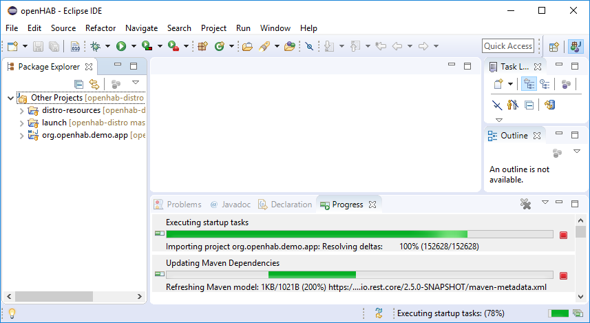
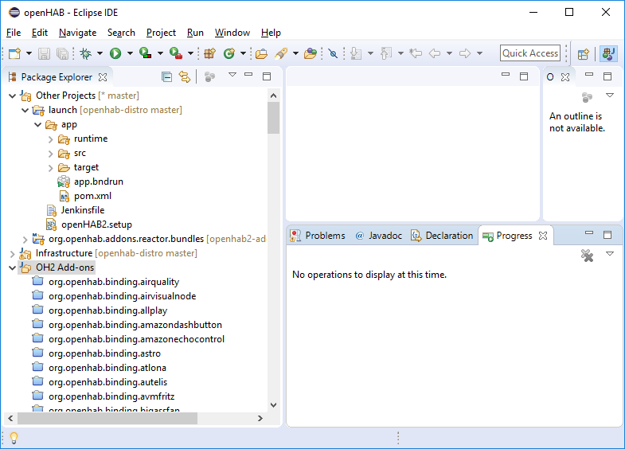
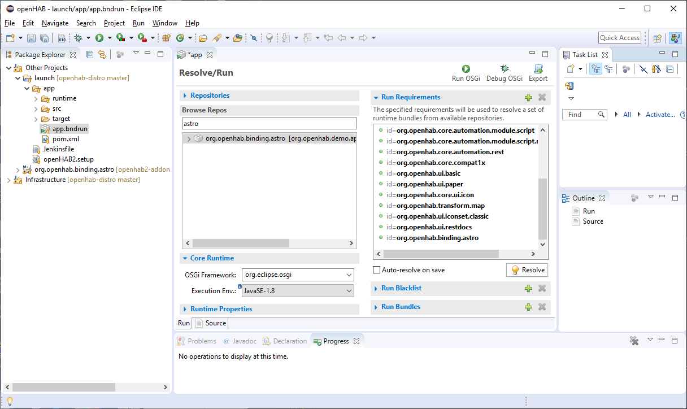

# Eclipse IDE

::: tip TODO
We are currently reworking how to setup a perfect development environment.
A new step by step guide will appear here soon.
:::

For now follow these steps:

### Eclipse IDE Setup

This guide focuses on existing Add-on (binding) development.

1. Download the "Eclipse Installer": [can be downloaded from the Eclipse web site](https://wiki.eclipse.org/Eclipse_Installer)

1. Launch the Installer and on the menu on the top right (3 bars) select `ADVANCED MODE...`, then select `Eclipse IDE for Java Developers` then `Next >`.

    Eclipse version to use is "Latest Release (2019-03)" (currently version `2019-06` does not support bndtools)

1. Under `Github Projects > openHAB` select `openHAB Development` and any desired option from `openHAB Add-ons` (includes all add-ons from openhab2-addons repo), `openHAB ZigBee Binding` or `openHAB Z-Wave Binding`.
    
   

1. Click `Next>`, verify/modify Root and install folder name, click `Next>` and `Finish` to start installation. 
    During install accept licence agreement, "Unsigned Content" for Bndtools, and Eclipse Foundation certificates when requested to complete IDE installation. 
    When the Eclipse installation is finished the IDE is launched automatically.

1. **It's important**, during the first Eclipse IDE launch, to leave Eclipse open until all openHAB related initial Setup tasks / Download sources / Builds are completed. 

    Setup tasks will personalize the IDE with openHAB code formatting tools, configurations and a demo app.
	Setup tasks will also download openHAB lastest `openhab2-addons` and `openhab-distro` rcode epositories and related maven dependencies. 
	Click bottom right button in the IDE for Progress.

    

    When visible in the Package Explorer, select `OH2 Add-ons` and from right-click menu select "Close Projects": this significantly speeds up the setup.
    Re-open only the binding project(s) you would like to work on.

    **It may take 30-45mins for all initial tasks to finish, depending on internet connection and your computer speed.
    So... go and grab a good cup of coffee and be patient until is finished**

   

1. After all tasks are finished, look for `app.bndrun` file in the Eclipse Package Explorer in `Other Projects > launch > app` project folder.
   Double click to open `app.bndrun` file (takes a few seconds)

1. Under Browse Repos search for the binding you want to run/debug (`astro` in our case) and add it to the "Run Requirements" list using drag&drop from the "Browse Repos" list:
       

    NOTE: If the binding you want to run/debug cannot be found in the Browse Repos list, or the list is empty, then follow these steps to rebuild the list of bindings in the BOM (Bill Of Material) and make your new binding visible from the IDE launch configuration:

    - using Git bash console go to `git\openhab2-addons\bom\openhab-addons`
    - recreate the BOM with: `mvn -DskipChecks -DskipTests clean install`
    - go back to Eclipse, close and re-open the `app.bndrun` file and now you should be able to find the binding in the list

1. Save and click "Resolve": a window with the list of resolved bundles will be shown.
    Click `Finish` and save the file.

Now the IDE is ready to start openHAB with a minimum set of the openHAB core bindings, UIs and the selected binding you want to run/debug.

1. Start openHAB from the IDE clicking "Run OSGi" or "Debug OSGi" (upper right of the `app.bndrun` window)

1. You can check openHAB is running going with your browser to: http://localhost:8080/paperui/ (the last `/` is important!)

1. Check the chosen binding is active in `Paper UI > Configuration > Bindings`

## Develop a NEW binding with the Eclipse IDE

To start developing a new binding follow these steps:

1. Close Eclipse
1. From the command line in `openhab2-addons/bundles` directory run:

    `$ ./create_openhab_binding_skeleton.sh  MyNewBinding <Author> <GitHubUsername>`

    to create a skeleton of a new binding `mynewbinding`.
    Accept with `Y` the skeleton configuration.

1. Edit file `openhab2-addons/bom/openhab-addons/pom.xml` and add your new binding to the list (adapt the artifactid to your binding name!):
    ```
    <dependency>
        <groupId>org.openhab.addons.bundles</groupId>
        <artifactId>org.openhab.binding.mynewbinding</artifactId>
        <version>${project.version}</version>
    </dependency>
    ```

1. From the `git\openhab2-addons\bom\openhab-addons` directory run: `mvn -DskipChecks -DskipTests clean install` to rebuild the list of bindings in the BOM (Bill Of Material) and make your new binding visible from the IDE launch configuration

1. Open Eclipse and import your new binding project 

1. Follow from previous step 7. to select and run/debug your new binding in the Eclipse IDE

Now you can start developing your NEW binding.

In case the new binding has dependencies to other bundles/libraries see [Adding Dependencies](../buildsystem.html#adding-dependencies) for more information.
